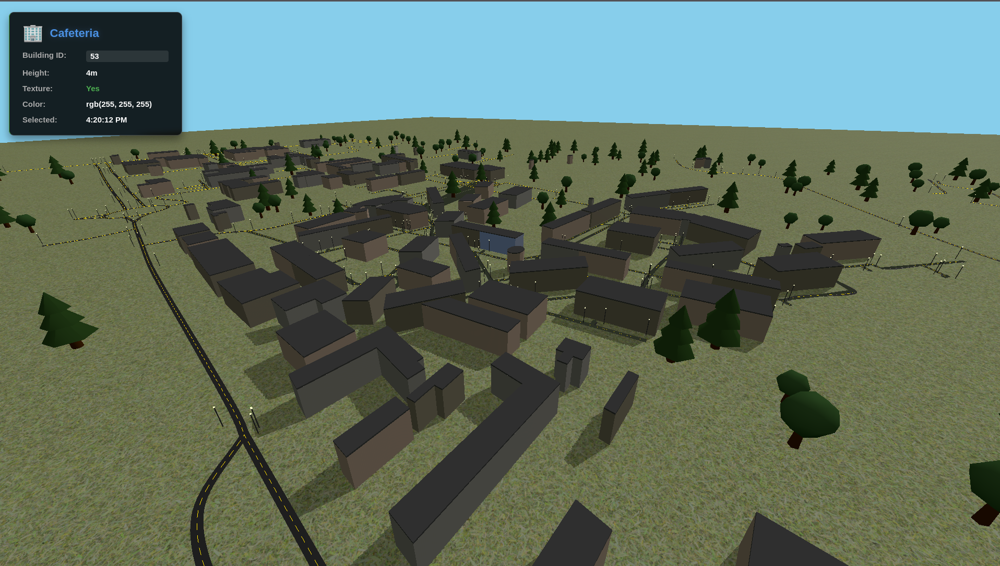

# 🏙️ NeighborhoodThreeJs

A 3D interactive campus map built with **Three.js**, rendering real GeoJSON map data into a navigable 3D environment — complete with buildings, roads, trees, and street lighting.

---

## 📸 Preview

> A bird's-eye view of the campus with buildings, roads, trees and street lights rendered from real GeoJSON data.

---

## ✨ Features

- **Real GeoJSON data** — buildings, roads, and walkways loaded from actual OSM-exported map data
- **114 individual buildings** — each with unique footprints, heights, wall textures, and canvas-painted window patterns
- **Multi-material buildings** — side walls use canvas textures with floor-by-floor window grids; rooftops use a separate flat concrete material
- **Procedural roads** — extruded along CatmullRom curves with dashed yellow center lines
- **Street lighting** — poles placed alternately on both sides of every road
- **Procedural trees** — two tree styles (conifer and round canopy), placed using real GeoJSON point data with fallback to random generation
- **Collision-aware tree placement** — trees avoid building footprints and road center lines
- **Clickable buildings** — click any building to see its name, ID, height, and texture info in the UI panel
- **WASD keyboard navigation** — move the camera around the campus
- **OrbitControls** — mouse drag to orbit, scroll to zoom
- **Optimised for Firefox** — reduced shadow map size, shared geometries/materials, `MeshLambertMaterial` for trees and lights

---

## 🗂️ Project Structure

```
NeighborhoodThreeJs/
├── index.html              # Entry point
├── main.js                 # Main Three.js scene — all rendering logic
├── package.json
├── src/
│   └── materials.js        # Shared walkway, road, and building materials
├── data/
│   ├── osm_roads.geojson   # Road network (LineString features)
│   ├── walkways.geojson    # Campus walkway polygons
│   ├── trees.geojson       # Tree point data (optional, falls back to random)
│   └── campus/
│       └── unknown/
│           ├── building_1.geojson
│           ├── building_2.geojson
│           └── ...         # One GeoJSON file per building (114 total)
├── textures/
│   ├── Grass004_2K-JPG/
│   ├── red_brick_1k/
│   ├── stone_brick_wall_001_1k/
│   └── patterned_brick_wall_03_1k/
└── campus/
    └── buildings/          # Additional building assets
```

---

## 🚀 Getting Started

### Prerequisites

- [Node.js](https://nodejs.org/) v16+
- npm

### Installation

```bash
# Clone the repository
git clone https://github.com/ihaliti03/NeighborhoodThreeJs.git
cd NeighborhoodThreeJs

# Install dependencies
npm install
```

### Running Locally

```bash
npm run dev
```

Then open [http://localhost:5173](http://localhost:5173) in your browser.

### Building for Production

```bash
npm run build
```

---

## 🎮 Controls

| Input | Action |
|-------|--------|
| `W` / `↑` | Move camera forward |
| `S` / `↓` | Move camera backward |
| `A` / `←` | Strafe left |
| `D` / `→` | Strafe right |
| **Left mouse drag** | Orbit / rotate view |
| **Right mouse drag** | Pan |
| **Scroll wheel** | Zoom in / out |
| **Click a building** | Show building info panel |

---

## 🏗️ How It Works

### Buildings
Each building is loaded from its own GeoJSON file. The polygon footprint is extruded to the building's estimated height using `THREE.ExtrudeGeometry`. A **two-material array** is applied — `[wallMaterial, roofMaterial]` — so the extruded side faces receive a canvas-painted wall texture (with per-floor window grids) while the cap faces get a flat concrete roof colour. Buildings without brick/stone textures receive a unique warm tint seeded by their building ID.

### Roads
Road `LineString` features are converted to `CatmullRomCurve3` paths and extruded into flat ribbon meshes. Dashed yellow center lines are drawn as `THREE.Line` objects using `LineDashedMaterial`. Street light poles are placed alternately on each side every ~60 world units.

### Trees
Tree positions are read from `trees.geojson` if present, otherwise generated randomly within the campus bounding box. Before placing any tree, an `isTooClose()` check tests against:
- All building bounding boxes (collected directly from GeoJSON at parse time)
- All road spine sample points (collected during road loading)

This prevents trees from spawning inside buildings or on roads.

### Textures
Three brick/stone textures are distributed across buildings using a seeded lookup table. Buildings not in the table receive procedural canvas wall textures. Grass and road textures use `RepeatWrapping` for seamless tiling.

---

## ⚡ Performance Notes

This project targets smooth performance in Firefox on integrated/mid-range GPUs. Key optimisations applied:

- `antialias: false` on the WebGL renderer
- Shadow map capped at `1024×1024` with `BasicShadowMap`
- Shadow camera tightly fitted to the campus area (±200 units)
- `MeshLambertMaterial` for trees and street lights instead of `MeshStandardMaterial`
- Shared geometries and materials for all tree instances and lamp posts
- Road step count reduced to 50 (from 200)
- Single `THREE.Line` per road for center lines instead of per-dash meshes
- No `PointLight` sources — ambient + directional lighting only
- Canvas wall textures cached by colour — same tint reuses the same texture

---

## 📦 Dependencies

| Package | Purpose |
|---------|---------|
| [three](https://threejs.org/) | 3D rendering engine |
| [vite](https://vitejs.dev/) | Build tool and dev server |

---

## 📄 License

This project is open source. See the repository for details.

---

## 🙌 Acknowledgements

- Map data sourced from **OpenStreetMap** contributors
- Campus footprint data represents **SEEU (South East European University)**, Tetovo
- Built with [Three.js](https://threejs.org/)
